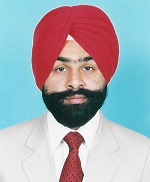

| Photo |  
| ------ | -------- |
| Name | Dr. Parminder Singh |
| Date of Birth | 12th July 1978 |
| Designation | Professor |
| Department | Computer Science and Engineering |
| Email | parmindersingh@gndec.ac.in |
| Experience | 1. Professor(G.N.D.E.C.,Ludhiana)[from 29 April, 2016 to till date] '>'2.Associate Professor(G.N.D.E.C.,Ludhiana)[from July 2009 to 28 April, 2016] '>'3.Assistant Professor(G.N.D.E.C.,Ludhiana)[from July 2006 to July 2009] '>'4.Lecturer(G.N.D.E.C.,Ludhiana)[from Feb 2000 to June 2006] '>'5.Lecturer(Baba Isher Singh Polytechnic,Moga)[from Sept 1999 to Feb 2000] | 
| Qualification | 1. Ph.D. (CSE) [2014] 2. M.Tech(CSE)[2005] 3. B.Tech(CSE)[1999] 4. 10+2[1994] 5. Matriculation[1992] |
| No. of Publications (Journal) | 23 |
| No. of Publications (Conference) | 37 |
| Professional Memberships | 1. Life member, Indian Society for Technical Education, New Delhi 2. Life member, Punjab Academy of Sciences 3. Life member, Computer Society of India 4. Senior member, Indian Institution of Industrial Engineering, Navi Mumbai 5. Life member, Indian Science Congress Association, Kolkata 6. IEEE membership, IEEE Computer Society membership 7. Life member, The Institution of Engineers (India), Kolkata 8. Member, The Association for Computational Linguistics (ACL), USA |
| Research Interest | Natural Language Processing, Speech Synthesis and Speech Recognition |
